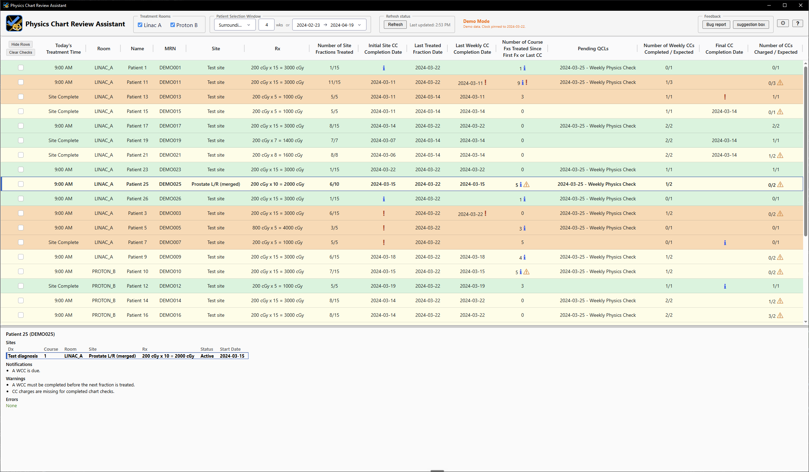

# Physics Chart Review Assistant

> **Not a medical device:** an aid to a qualified physicist's own review, with no warranty. See
> the [disclaimer](docs/disclaimer.md).

## Overview

The Physics Chart Review Assistant is designed to assist a qualified medical physicist evaluate a 
radiotherapy patient's treatment course.

The current alpha release provides basic chart check (CC) completion auditing. Later releases will 
seek to consolidate the relevant pieces of OIS information into a simple dashboard (warning-grade 
tool), with an eventual goal of automating as much of this process as possible (decision-grade tool).

## Features

- **Chart check audit:** Reads dx, rx, site, tx calendar and chart check status for patients with a
  scheduled or treated fraction within the selection window.
- **Customizable rules:** Settings menu allows room-specific chart check counting rules.
- **Clinic adaptable:** Configurable to any number of proton or photon treatment rooms.
- **QCL independent:** Can be used alongside, or independent of, a QCL-based chart check system.
- **Custom sorting:** Rows sortable by pending chart checks.
- **Mosaiq patient selection:** Loads the selected patient in the Mosaiq client with one click.
- **Bug reports:** Captures the user's description and a dump of the app state for reproduction.
- **Suggestion box:** Collects feature requests from users.
- **Single click deployment:** Single-click install and update from a self-contained installer.

## Documentation

- **[User guide](docs/user-guide.md):** the dashboard and every check rule
- **[Install](docs/install.md):** requirements, installer, database connection, clinic config
- **[Admin guide](docs/admin-guide.md):** architecture, PHI and security
- **[Developer guide](docs/developer-guide.md):** project design, adding a check, testing,
  build from source
- **[Disclaimer](docs/disclaimer.md):** not a medical device; no warranty

## Install

- **Download:** `ChartReviewAssistant-Setup.exe` from the Releases page; no administrator
  rights
- **Configure:** `db_config.toml` and `clinic_config.toml`, from your clinic or from the
  example files; see [Install](docs/install.md)
- **Demo:** the **Physics Chart Review Assistant (Demo)** shortcut needs neither

## License

[Apache-2.0](LICENSE).
