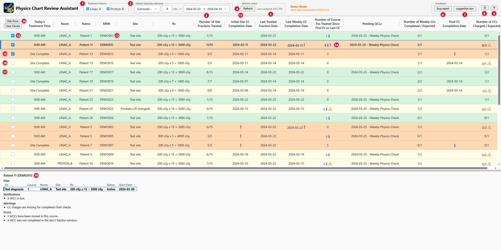
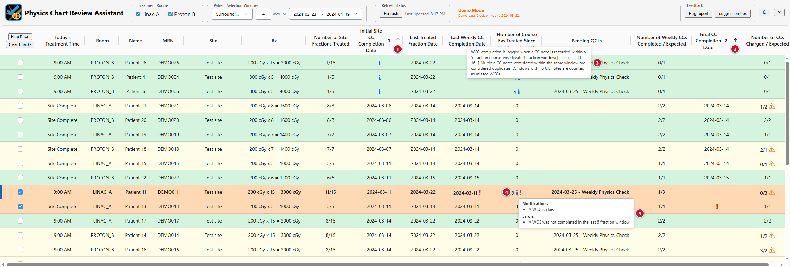
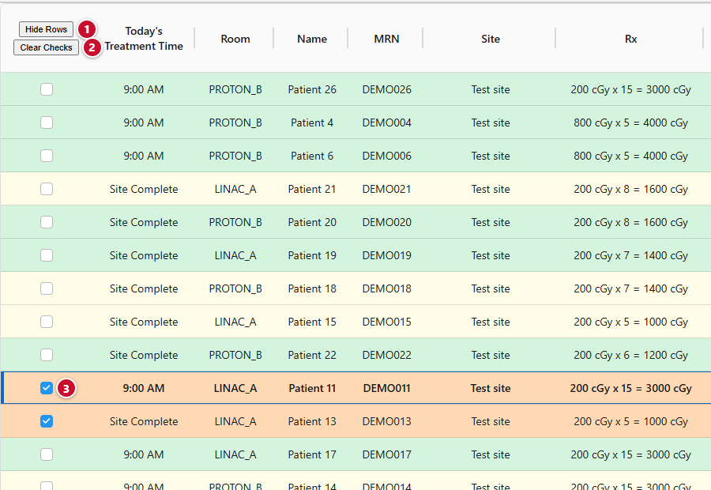
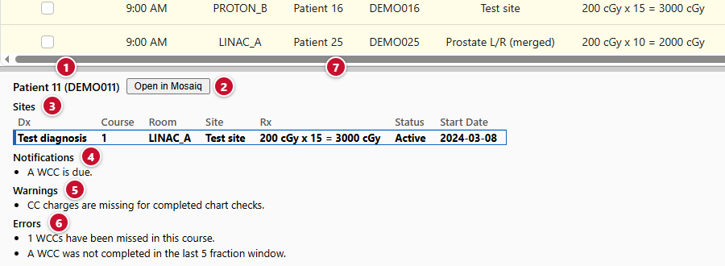
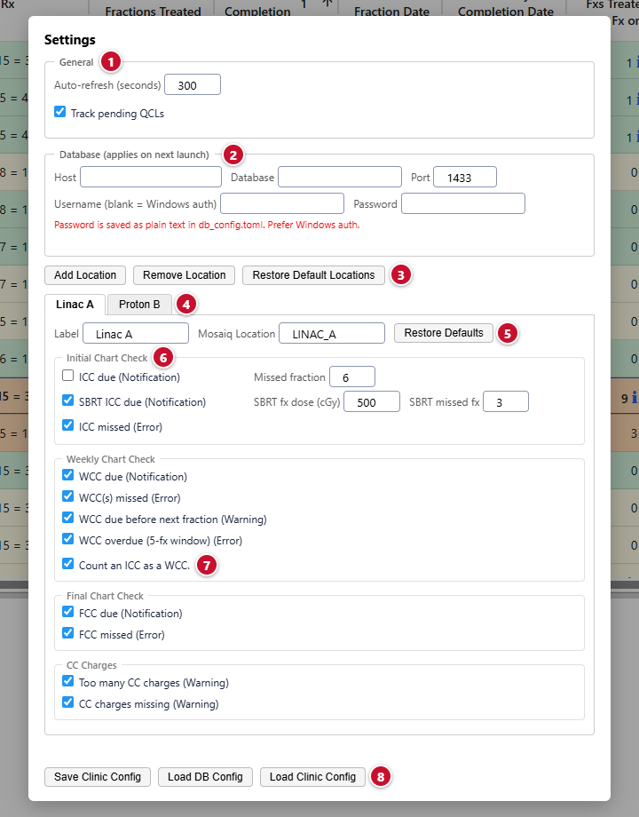
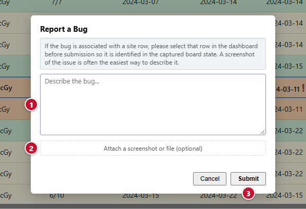

# User Guide

> **Not a medical device:** an aid to a qualified physicist's own review, with no warranty. See
> the [disclaimer](disclaimer.md).

## Quick links

- **[README](../README.md):** overview, features
- **[Install](install.md):** requirements, installer, database connection, clinic config
- **[Admin guide](admin-guide.md):** architecture, PHI and security
- **[Developer guide](developer-guide.md):** project design, adding a check, testing, build
- **[Disclaimer](disclaimer.md):** not a medical device; no warranty

## Dashboard operation

&emsp;**1 - Rooms:** checklist of treatment rooms\
&emsp;**2 - Window:** number of weeks and a direction (past, surrounding, next)\
&emsp;**3 - Custom range:** a start and end date in place of the weeks window\
&emsp;**4 - Refresh:** pulls now\
&emsp;**5 - Status:** time of the last pull\
&emsp;**6 - Bug report:** opens the bug report dialog\
&emsp;**7 - suggestion box:** opens the suggestion dialog\
&emsp;**8 - Settings:** opens the Settings dialog\
&emsp;**9 - Help:** refresh and sort help and the row color legend\
&emsp;**10 - Hide Rows, Clear Checks:** act on the ticked rows\
&emsp;**11 - Column header:** click to sort; hover for the rule behind the column\
&emsp;**12 - Tick:** marks a row for hiding\
&emsp;**13 - MRN:** click to copy\
&emsp;**14 - Icons:** one per level in a column with a finding; hover lists the messages\
&emsp;**15 - Orange row:** an error\
&emsp;**16 - Yellow row:** warnings\
&emsp;**17 - Green row:** no warnings or errors\
&emsp;**18 - Info pane:** details for the selected row

### Patient selection

- **Who appears:** see Row selection under Check rules
- **Memory:** the selection is remembered between sessions
- **Auto refresh:** on the Settings interval (default 60 s)
- **Banner:** a configuration or connection problem is reported at the top

### Columns

| Column | Meaning |
|---|---|
| Today's Treatment Time | earliest appointment today in the selected rooms, or the status when none |
| Room | machine of the site's first scheduled fraction |
| Name, MRN | from Mosaiq; click the MRN to copy it |
| Site, Rx | site name; dose per fraction x fractions = total |
| Number of Site Fractions Treated | treated / prescribed for this site |
| Initial Site CC Completion Date | ICC note date, or a due or missed icon |
| Last Treated Fraction Date | most recent fraction of the course |
| Last Weekly CC Completion Date | most recent note that counts toward a WCC |
| Number of Course Fxs Treated Since First Fx or Last CC | position in the current 5-fraction window |
| Pending QCLs | next pending physics QCL by due date (optional column) |
| Number of Weekly CCs Completed / Expected | windows completed / windows opened so far |
| Final CC Completion Date | FCC note date, or a due or missed icon |
| Number of CCs Charged / Expected | chart check charges / allowed charges |

### Hover and sorting

&emsp;**1 - Primary sort:** click a header; click again to reverse; a third click clears it\
&emsp;**2 - Secondary sort:** Shift-click a second header; the number shows the priority\
&emsp;**3 - Header tooltip:** hover a header for the rule behind the column\
&emsp;**4 - Icon:** one per level in a column with a finding\
&emsp;**5 - Icon tooltip:** hover an icon for the messages
- **Completion date columns:** due first, then dates, then blanks
- **Count columns:** numeric, N/A last in both directions
- **Memory:** the sort is remembered between sessions

### Hiding rows

&emsp;**1 - Hide Rows:** removes the ticked rows; reads Unhide Rows while rows are hidden\
&emsp;**2 - Clear Checks:** unticks every row\
&emsp;**3 - Tick:** a ticked row
- **Memory:** hidden rows persist across refreshes and sessions

### Info pane

&emsp;**1 - Identity:** the patient\
&emsp;**2 - Open in Mosaiq:** selects the patient in Mosaiq\
&emsp;**3 - Sites:** every site in the course\
&emsp;**4 - Notifications:** findings at the notification level\
&emsp;**5 - Warnings:** findings at the warning level\
&emsp;**6 - Errors:** findings at the error level\
&emsp;**7 - Resize:** drag the pane's top edge
- **Open in Mosaiq:**
  - **Action:** selects the patient in the running Mosaiq client
  - **Needs:** Mosaiq open on the same machine
  - **On failure:** the button reports it and nothing happens; close any Mosaiq dialog and
    click again

### Settings

&emsp;**1 - General:** auto-refresh interval; Pending QCLs column on or off\
&emsp;**2 - Database:** connection fields; applied on the next launch\
&emsp;**3 - Locations:** Add Location, Remove Location, Restore Default Locations\
&emsp;**4 - Room tabs:** one per treatment room; label and Mosaiq room name below\
&emsp;**5 - Restore Defaults:** returns the tab to the clinic baseline\
&emsp;**6 - Checks:** which run; the ICC missed fraction, SBRT dose threshold and SBRT missed fraction\
&emsp;**7 - Count an ICC as a WCC:** on or off\
&emsp;**8 - Clinic files:** Save Clinic Config, Load DB Config, Load Clinic Config; see the admin guide

### Bug reports and suggestions

&emsp;**1 - Description:** the problem; select the affected row first so the capture identifies it\
&emsp;**2 - Attachment:** a screenshot or file, optional\
&emsp;**3 - Submit:** saves the description, attachments, dashboard data and app state; contains PHI
- **suggestion box:** the same dialog without dashboard data

## Check rules

The dashboard reads five Mosaiq records: treatment history (delivered fractions), the treatment
calendar (scheduled fractions), chart check notes, chart check charges and, when the Pending
QCLs column is on, physics QCLs. Findings come from the first four; QCLs are displayed, not
checked. The app does not read a note's content, only its type and creation time.

### Row selection

- **Patients:** anyone with a scheduled or treated fraction in a selected room inside the date
  window
  - **Holds:** held appointments (`hold_activities`; default `HLD%`, `HOLD%`, `DONOTSCHED`) do
    not count
  - **Skipped:** MRNs in `skip_mrns` are hidden
- **Rows:** one per treatment site
  - **Courses:** sites group by care plan (`PCP_ID`)
  - **Scope:** ICC is per site; WCC, FCC and charges are per course
  - **No prescription:** a site with a zero or missing prescription is not shown
  - **Prostate L/R:** concurrent sites treated on alternating days merge into one row

### Chart check notes

- **Definition:** a note whose type is in `cc_note_types` (default 50, eChart Check)
- **Counted when created:**
  - **After:** the first treated fraction
  - **Before:** 5 business days after the last scheduled fraction
- **Plan checks:** a note before the first fraction does not count

### Initial chart check (ICC)

- **Scope:** per site; due at the first treated fraction; completed by the first chart check
  note after it
- **Criteria:**
  - **ICC due (notification):** all of
    - **Treated:** at least one fraction of the site has been treated
    - **No note:** no chart check note exists after the first treated fraction
    - **Below threshold:** fewer fractions treated than the room's missed threshold
    - **Course open:** the course is not complete
  - **SBRT ICC due (notification):** the ICC due criteria on an SBRT site, using the SBRT
    missed threshold
  - **ICC missed (error):** any of
    - **Threshold reached:** the threshold fraction has been treated and no note exists
    - **Late note:** the first note was created after the threshold fraction; the note does
      not count and the completion date is cleared
    - **Course complete:** every site has treated its fractions and the ICC is still due
- **Thresholds:**
  - **`icc_missed_fx` (default 6):** the check is missed once this fraction is treated
  - **SBRT site:** per-fraction dose at or above `sbrt_fx_dose_cgy` (default 500 cGy; RBE dose
    when the prescription is in CcGE)
  - **`sbrt_missed_fx` (default 3):** the threshold for SBRT sites

### Weekly chart check (WCC)

- **Scope:** per course; counted by treated fractions, not calendar weeks
- **Windows:**
  - **Open:** at the 1st, 6th, 11th ... treated fraction
  - **Close:** at the next 5th treated fraction
  - **Else:** at the 5th scheduled fraction after opening
  - **Else:** 5 business days after the last scheduled fraction
  - **Completion:** one note inside the window; further notes in the same window are duplicates
- **Criteria:**
  - **WCC due (notification):** all of
    - **Open window:** the most recently opened window has no counted note
    - **Course open:** the course is not complete
  - **WCC must be completed before the next fraction (warning):** exactly 5 fractions treated
    since the last counted note, or since the first fraction when no note exists
  - **WCC not completed in the last 5 fraction window (error):** 6 or more fractions treated
    since the last counted note, or since the first fraction when no note exists
  - **N WCCs missed (error):** N windows have closed (their 5th later fraction treated) with no
    counted note inside them
- **Count an ICC as a WCC:**
  - **On (default):** the ICC note completes the window it falls in
  - **Off:** the earliest ICC note in the course is excluded from every weekly tally
  - **Second phase:** an ICC in a window already completed by a weekly note is a duplicate; it
    still resets the fractions-since-last-check count
- **Completed site:** drops its weekly warnings; errors and notifications stay

### Final chart check (FCC)

- **Scope:** per course; due when every site has treated its prescribed fractions
- **Completion:** a chart check note at or after the last treated fraction
- **Criteria:**
  - **FCC due (notification):** all of
    - **Course complete:** every site has treated its prescribed fractions
    - **No note:** no chart check note exists at or after the last treated fraction
    - **In window:** today is no later than 5 business days after the last treated fraction
  - **FCC missed (error):** the first two criteria hold and today is past that window

### Chart check charges

- **Scope:** per course; skipped when `cc_cpt_code` is blank
- **Allowed charges:**
  - **Rule:** one per opened 5-fraction window
  - **Exception:** a final window of 1 or 2 scheduled fractions
  - **Full course:** one per 5 fractions, plus one for a remainder of 3 or 4
- **Criteria:**
  - **Too many CC charges (warning):** charges billed in the course span exceed the allowed
    count
  - **CC charges missing (warning):** charges billed are fewer than the smaller of completed
    WCCs and the allowed count; a check in a short final window needs no charge

### Per-room settings

- **Off:** a check that is off for a room produces no finding on that room's rows
- **Thresholds:** the ICC missed fraction, SBRT dose threshold and SBRT missed fraction are
  per room; see Settings above

